### 1. 프로젝트 소개
#### 1.1. 배경 및 필요성
- 멀티 클라우드 환경과 MSA 도입으로 애플리케이션이 여러 인프라에 **분산**됨에 따라 로그 데이터의 양이 급증했고, 이를 체계적으로 수집하고 신속히 분석할 수 있는 역량이 중요해졌다.
- 이러한 환경에서, 다양한 소스에서 생성되는 로그를 일관되게 처리하고 실시간으로 분석할 수 있는 능력은 시스템 운영의 핵심 요소가 되었다.
- **그러나** 기존의 규칙 기반 탐지 방식은 **고정된 패턴**이나 **조건**에 의존하기 때문에, 새로운 문제나 예상치 못한 비정상적인 동작을 감지하는 데 **한계**가 있다.
- 이에, LLM 기반 로그 분석 시스템을 도입하여, 로그 데이터를 자동으로 **요약**하고, 비정상적인 패턴을 **탐지**함으로써 관리자가 핵심 정보를 빠르게 **파악**하고 **대응**할 수 있게 한다.</br></br>

#### 1.2. 목표 및 주요 내용
#### □ 목표</br>
- 목표는 멀티 클라우드 환경에서 발생하는 대규모 로그 데이터를 효율적으로 수집하고, **LLM** 을 활용해 이를 요약하고 분석하는 시스템을 구축하는 것이다.</br>
- 실시간 로그 모니터링을 통해 주요 이벤트를 **포착**하고, 이상 패턴을 신속히 **탐지**하여, 관리자가 로그 데이터를 **일일이** 분석하지 않고도 핵심 정보를 파악할 수 있게 돕는다</br>
- 특히, 로그 데이터를 계층적으로 요약하고 **중요도**에 따라 정보를 **선별적**으로 제공함으로써, 관리자가 **핵심 정보**에 **집중**하여 시스템을 보다 효율적으로 모니터링하고 파악할 수 있게 한다. 또한, **구체적인 대응 방안**을 관리자에게 제시하여, 비정상적인 시스템 동작에 신속히 대응할 수 있도록 지원한다.</br>
- 이 시스템을 통해 관리자는 대규모 로그 데이터 분석에 수반되는 부담을 덜고, 실시간으로 발생하는 문제를 보다 신속하고 효율적으로 해결할 수 있다.</br>

#### □ 주요 내용</br>
- 광범위한 데이터 학습으로 **범용성**을 갖춘 LLM을 활용하여 로그 요약과 이상 패턴 탐지 기능을 구현함으로써, 특정 서비스에 **종속**되지 않고도 다양한 애플리케이션의 로그 데이터를 일관되게 분석할 수 있다. 또한, 범용성을 **유지**하면서도 로그 데이터를 **세밀**하게 분석할 수 있도록 정교한 **프롬프팅**을 적용했다.
- 다양한 로그 형식을 일관되게 처리하기 위해 Filebeat 와 Logstash 를 사용해 로그 데이터를 통합한 뒤, **공통된 구조**로 변환하여 Elasticsearch 에 저장한다. 이를 통해 **개별** 서비스의 형식에 구애받지 않고, **통일된 구조**로 로그 데이터를 **일관**되게 분석할 수 있다.
- **모든** 로그 데이터를 그대로 **저장**하고 처리하는 대신, 각 클라우드 인스턴스에서 수집된 로그를 시간대별로 분류하고 요약하여, 해당 시간대의 **주요 이벤트**를 **단계적으로 축적**하는 방식으로 저장한다.
- **모든** 로그 데이터를 LLM에 **입력**하는 것은 비효율적이므로, 시간대별로 요약된 데이터를 기반으로 일일 요약을 생성하고, 이를 종합해 주간 요약을 생성하는 **다단계 분석 방식**을 구현했다.
- **제한된** 토큰 수 내에서 대규모 로그 데이터를 효율적으로 처리하고 대화의 **연속성**을 보장하기 위해, 시스템이 대화가 일정량 누적될 때마다 이전 대화를 요약해 시스템 프롬프트에 자동으로 **포함**시키는 방식을 도입했다.
- 관리자가 실시간 성능 지표를 모니터링하고, SSH를 통해 **원격 서버**를 제어할 수 있게 하여, 문제 발생 시 신속하게 대응할 수 있는 환경을 마련했다.
- 다양한 기기에서 일관된 사용자 경험을 제공하기 위해 **반응형**로 구현된 웹 인터페이스를 제공한다.
</br>

### 2. 상세설계
#### 2.1. 시스템 구성도
#### □ 전체 구성도</br>
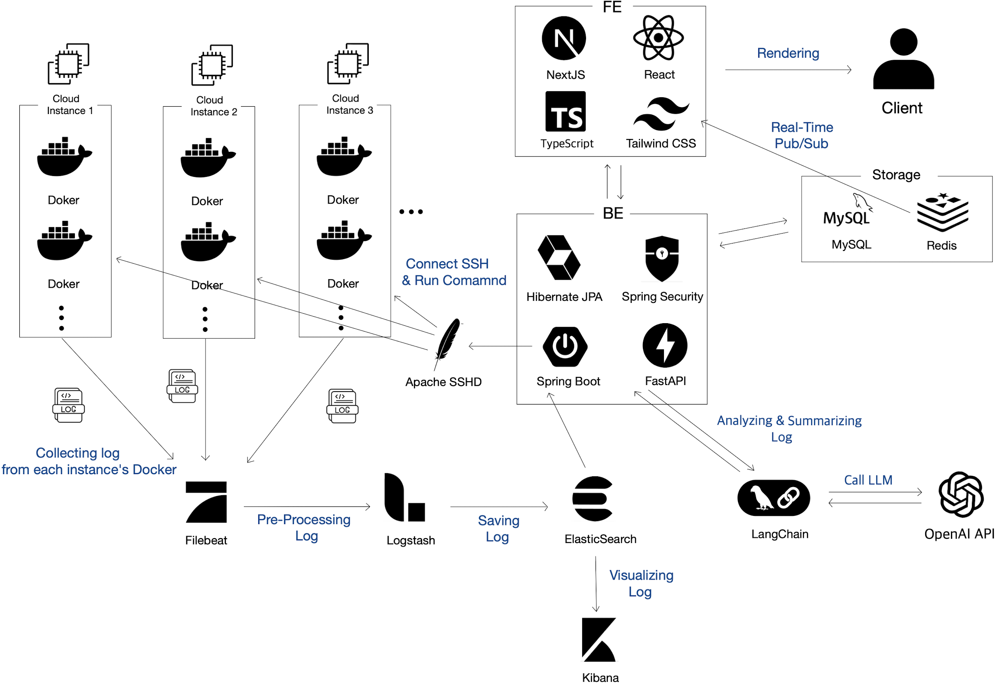
</br></br>

  > - 각 클라우드 인스턴스는 도커 컨테이너로 애플리케이션을 구동하며, 컨테이너에서 생성된 로그는 Filebeat가 수집해 Logstash로 전송 후 전처리.
  > - 전처리된 로그는 ElasticSearch에 저장되고, Spring Boot를 통해 로드한 후 최종적으로 .txt 파일 형식으로 로컬에 저장.
  > - 로그 데이터 분석과 요약에는 LangChain과 OpenAI API를 활용하고, 분석 결과는 웹 클라이언트를 통해 관리자에게 제공.
  > - Apache MINA SSHD를 통해 관리자는 클라우드 인스턴스에 원격으로 접속해 명령을 실행.
  > - 사용자 정보, 알림, 요약 결과, 성능 지표 등 주요 데이터는 MySQL에 저장되고, Redis는 캐시 및 메시지 브로커 역할을 하며 실시간 소켓 통신을 지원.
</br>

#### □ 로그 데이터 관리 </br>
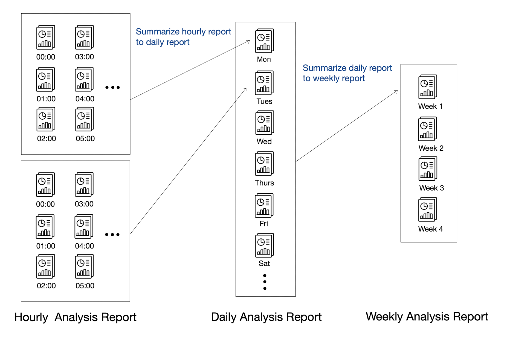
</br>

  > - 모든 로그 데이터를 그대로 저장하는 대신, 시간대별로 요약하여 주요 이벤트만 축적하는 방식으로 관리.
  > - 시간대별 요약 데이터를 바탕으로 '일일 요약'을 생성하고, 이를 다시 종합해 '주간 요약'을 생성하는 다단계 분석 방식 채택.
</br>

#### □ 토큰 한계를 해결하는 대화 맥락 유지 </br>
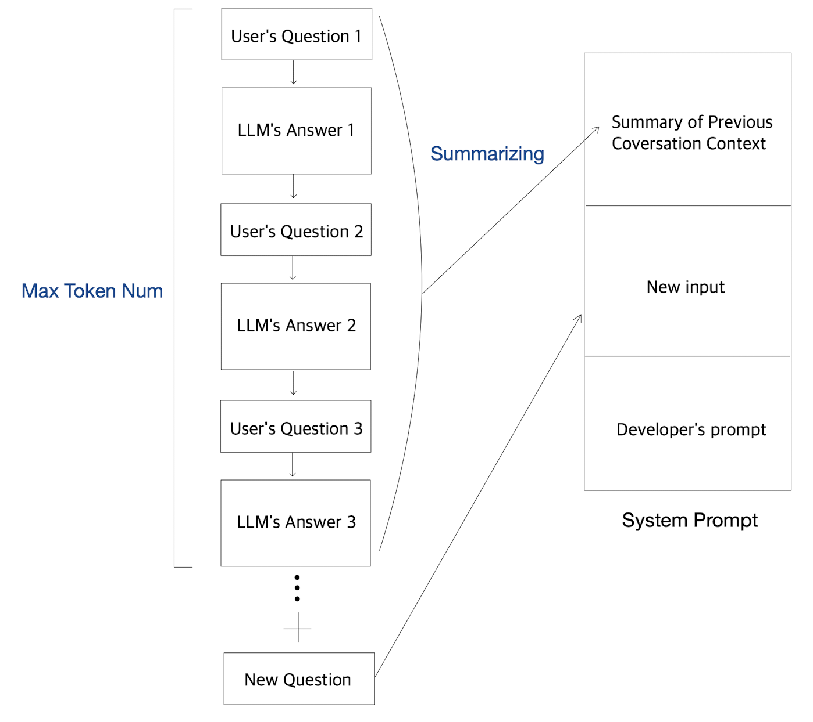
</br>

  > - 대화가 일정량 이상 누적될 때마다 시스템이 이전 대화를 요약하여 프롬프트에 포함.
  > - 요약된 대화는 새로운 질문과 함께 시스템 프롬프트에 추가되어, LLM이 이전 대화 맥락을 유지한 상태에서 답변할 수 있도록 지원.
</br>

#### 2.2. 사용 기술

| 번호  | 구분  | 버젼  |
|:----:|:-----:|:-----:|
| 1  | Filebeat | 8.5 |
| 2  | ElasticSearch | 8.15 |
| 3  | Logstash | 8.15 |
| 4  | Docker | 24.0.5 |
| 5  | Redis | 7.24 |
| 6  | MySQL | 8.0.33 |
| 7  | Java JDK | 17.0.9 |
| 8  | Spring Boot | 3.2.0 |
| 9  | JWT | 4.3.0 |
| 10 | Junit5 | 5.10.2 |
| 11 | FastAPI | 0.110.3 |
| 12 | Gradle | 8.5 |
| 13 | React | 18 |
| 14 | TypeScript | 5.6 |
| 15 | NextJS | 14.2.13 |
| 16 | Tailwind CSS | 3.4.1 |
| 17 | Apache MINA SSHD | 2.93 |
| 18 | Figma | UI3 |
</br>

### 3. 설치 및 사용 방법
#### □ 모니터링할 클라우드에 설치 </br>
> Requirements: Docker, Docker Compose </br>
```bash
git clone https://github.com/pnucse-capstone-2024/Capstone-2024-team-44.git
cd Capstone-2024-team-44/elk
docker compose up -d

```

#### □ 모니터링 서비스 설치 </br>
> Requirements: Docker, Docker Compose, OpenAI Key </br>
> (OpenAI 키가 있어야 정상적으로 서비스를 이용할 수 있습니다)
```bash
git clone https://github.com/pnucse-capstone-2024/Capstone-2024-team-44.git
cd Capstone-2024-team-44
docker compose up -d

```
</br>


### 4. 소개 및 시연 영상
#### □ 소개 </br>
|로그인|회원가입(3단계 중 2단계, 클라우드 등록)|
|:--:|:--:|
|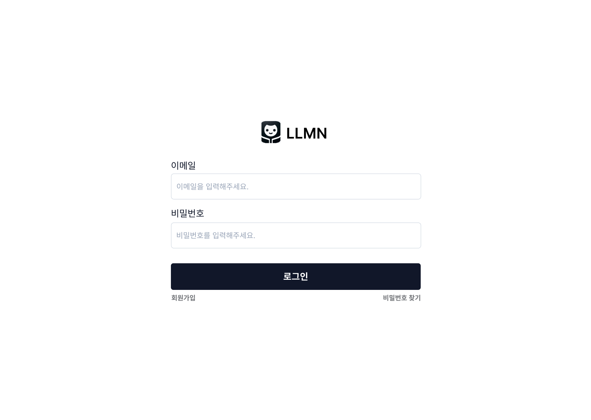|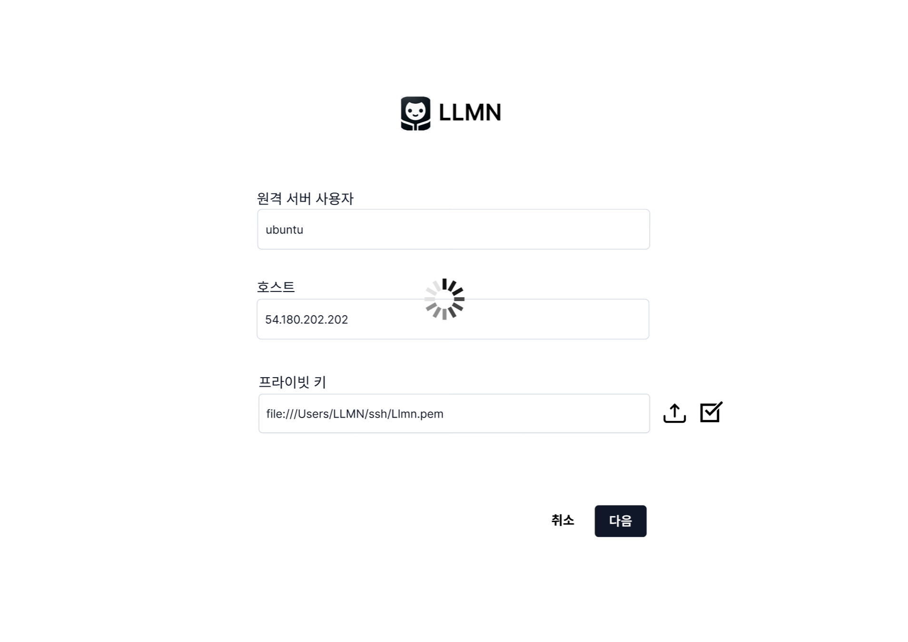|

|대시보드|검색|
|:--:|:--:|
|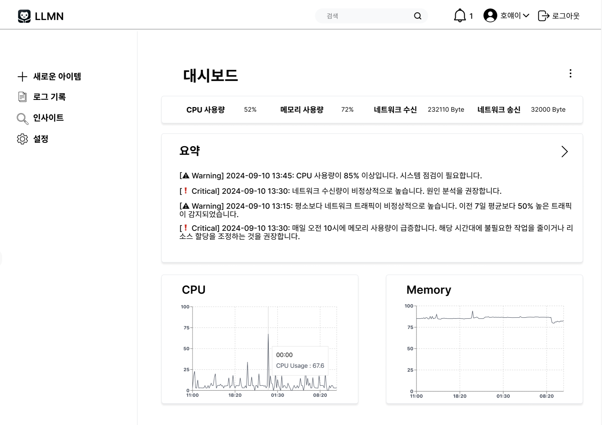|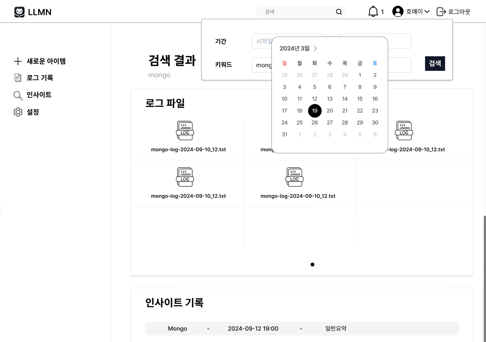|

|프로젝트 목록|프로젝트 상세조회|
|:--:|:--:|
|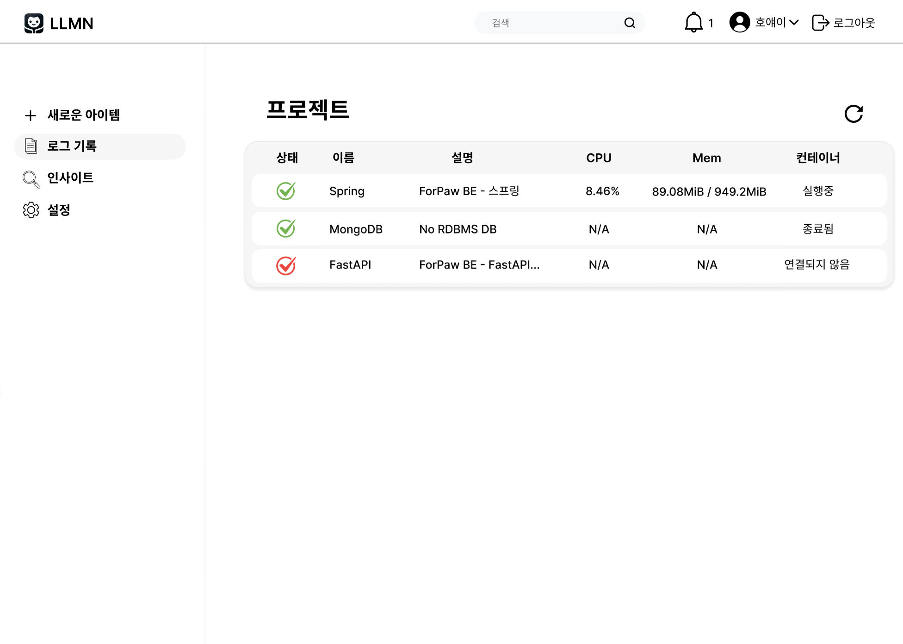||

|로그 조회|로그 요약|
|:--:|:--:|
|||

|질문하기|원격 SSH 명령|
|:--:|:--:|
|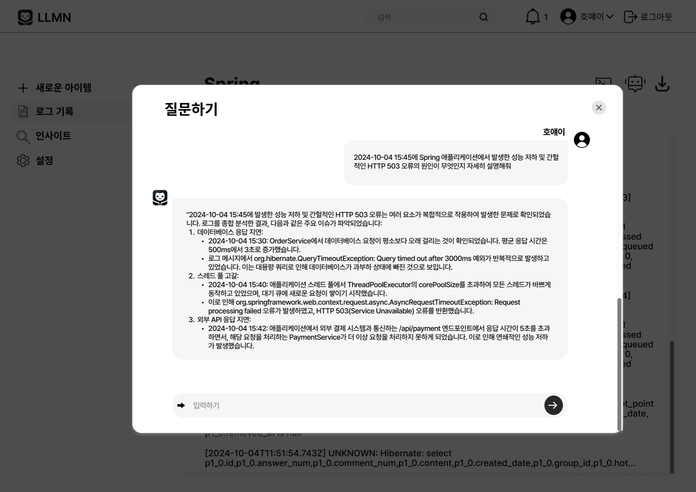|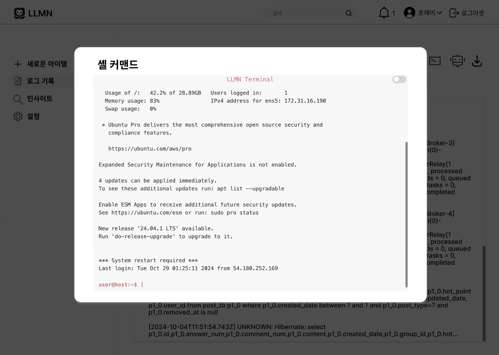|

|인사이트(성능요약, 일일요약) |인사이트(주간 요약, 추천)|
|:--:|:--:|
|||

#### □ 시연 영상 </br>
- 회원가입 (정보 입력 => 모니터링 할 클라우드의 SSH 정보 검증 및 추가 => OpenAI 키 검증 및 추가) 

https://github.com/user-attachments/assets/b7565570-59dd-4459-b86e-dc59c5bd0f54

</br>

- 로그인 => 로그 요약, 인사이트 => 검색 

https://github.com/user-attachments/assets/9c2ae38d-41b0-4252-9841-b8a054e96235

</br>

- 클라우드에 SSH 원격으로 명령 내리기

https://github.com/user-attachments/assets/1df00660-5230-4598-88d3-076efc01772e

</br>

- 특정 로그에 대해 챗봇에 질문하기

https://github.com/user-attachments/assets/b23fdeee-924a-478a-9b58-0596aaa2e955

</br>

#### □ 발표 영상 </br>
<a href="https://www.youtube.com/watch?v=EM1icrt529k&list=PLFUP9jG-TDp-CVdTbHvql-WoADl4gNkKj&index=43">
  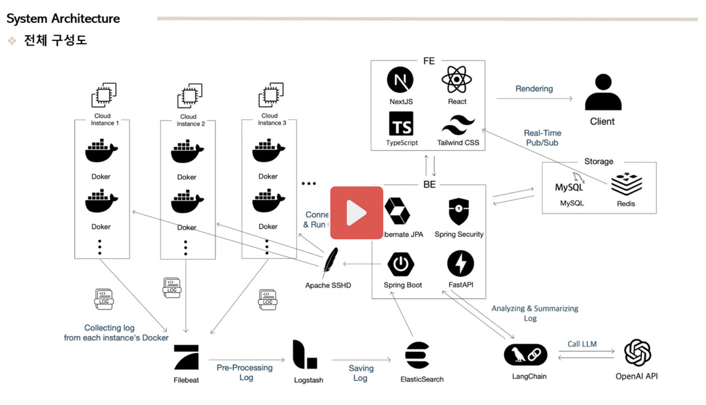
</a>
</br></br>

### 5. 팀 소개

| 이름  | 이메일  | 역할  |
|:----:|:-----:|---|
| 이한홍  | yg04076@pusan.ac.kr | <ul><li>REST API 및 DB 설계</li><li>Figma를 활용한 UI/UX 설계 및 디자인</li><li>Filebeat, Logstash, ElasticSearch을 연동한 로그 수집 파이프라인을 구축 및 Spring Boot와 통합</li><li>Apache SSHD로 클라이언트와 클라우드 서버 간 SSH 연결 기능 구현</li><li>SSE 기술로 LLM의 응답을 실시간 스트리밍 형식으로 제공하는 기능 구현</li><li>로그인, 회원관리, 프로젝트 관리, 성능 모니터링, 로그 분석 및 알림 API 개발</li><li>LangChain과 OpenAI API 연동, 프롬프트 작성 및 로그 분석 API 개발</li><li>서비스 배포</li><li>착수, 중간, 최종 보고서, 포스터 작성</li></ul> |
| 이종일  | leejongil1046@gmail.com | <ul><li>React, NextJS, TS, TailWind CSS를 이용한 웹 페이지 구현</li><li>UI/UX 개선을 통한 반응형 웹 페이지 구현</li><li>SSR 도입으로 실시간 데이터 처리 구현</li></ul> |
| 박재홍  | qkrwoghd2000@pusan.ac.kr | <ul><li>로그 분석을 위한 LLM 프롬프팅 작성에 기여</li><li>시연회 준비 및 발표 자료 제작</li></ul> |
